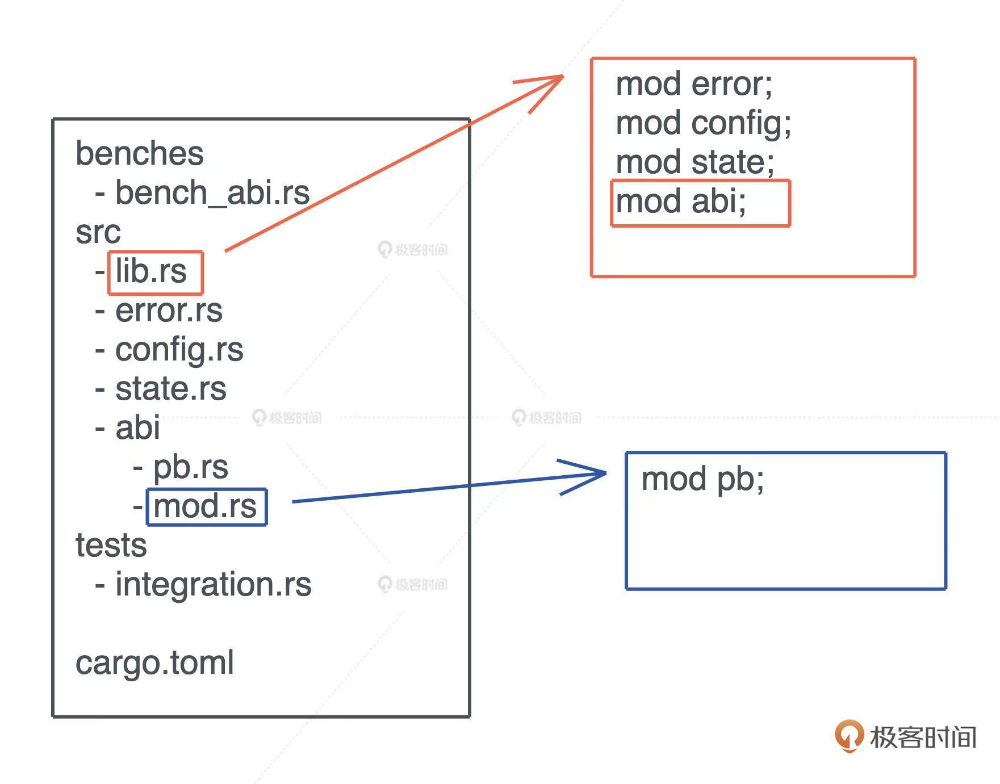
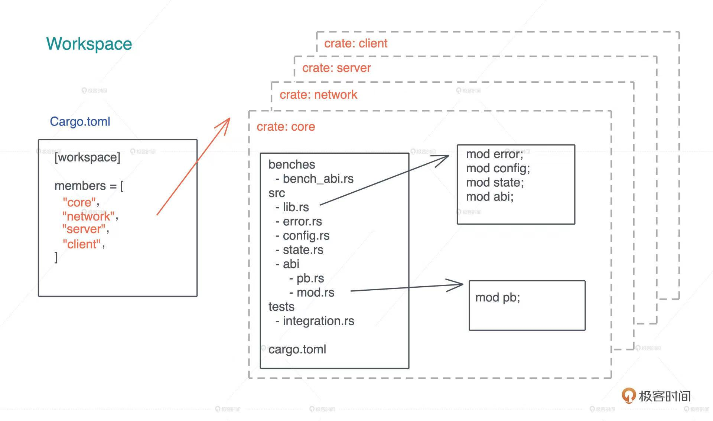

# 包、单元包、模块

## 包

> 使用Cargo new 命令可以新建一个包(Package)。\
> \
> 在文件系统中包是一个文件夹，其中包含src、target文件夹和cargo.toml文件

## 单元包

### 单元包的概念

> 包的下一级叫做单元包，注意：在文件系统中单元包不再是一个文件夹，而是若干*.rs文件。\
> \
> src中默认生成了main.rs，这就是一个二进制单元包，同时它也是所有二进制单元包的根节点。

### 单元包的种类

- 二进制单元包(*.rs文件，比如main.rs)
- 库单元包(特指lib.rs文件)
- main.rs是所有二进制单元包的根节点，**引用名称与包名相同**
- lib.rs是库单元包的根节点，**引用名称与包名相同**

### 单元包的使用规则

- 每个包必须包含一个单元包
- 每个包只能包含一个库单元包，但可以包含多个二进制单元包
- 可以在src/bin下添加.rs源文件，**每个文件代表一个单独的二进制单元包**

## 模块

### 模块的作用

> 单元包的下一级是模块，其作用是控制作用域及私有性。\
> 模块决定了一个条目是否可以被外部代码访问。

### 模块的特点

- 使用“mod 名称 {}”的方式来定义，确定了名称及作用域。

    ```rust
    mod front_of_house{
        ...
        mod hosting{
            fn add_to_waitlist(){}
        }
    }
    ```

- main.rs和lib.rs为什么会被称为根节点呢？就是由于他们还代表了名为crate的模块，这个模块同时也是**根模块**。\
那么上面的front_of_house，实际上还有一个“上级”，hosting其实是第三级的模块。

- 如何在模块树中定位？
  
  - 绝对路径
  
  ```rust
  use 单元包名::front_of_house::hosting //引用别的单元包必须使用单元包名
  use crate::front_of_house::hosting //在同一个单元包中才可以使用crate
  ```

  - 相对路径

  > 使用self、super从当前模块开始的相对路径，self代表平级，super代表父级

实例

```rust
pub mod front_of_house{
    pub mod hosting{
        pub fn add_to_waitlist(){
        }
    }
}

pub fn eat_at_restaurant(){
    //绝对路径
    crate::front_of_house::hosting::add_to_waitlist();
    
    //相对路径
    self::front_of_house::hosting::add_to_waitlist();

    //由于是平级引用so以下写法也可以
    front_of_house::hosting::add_to_waitlist()
}
```
### pub关键字

- 没有加pub关键字的模块、结构体、函数和方法，及其子项（比如结构体的字段，模块的子模块、方法等）都默认为私有。想要访问他们，需要他们本身和所有的父级都被添加pub关键字。

- 枚举类型与其他类型不同。一旦pub，则其所有的变体都为pub，不需要一个个添加pub。因为只有变体全为pub枚举才可用。

- **根节点定义的方法，不需要pub关键字即可访问根节点定义的mod**。例如，上面的eat_at_restaurant方法可以直接访问front模块，即便front_of_house模块没有pub关键字。但是，其子模块还是需要pub才可访问。

    ```rust
    mod t1 { // 没有pub
    pub mod hosting {
            pub fn h1() {}
        }
    }

    mod t2 {
        use crate::t1;//同文件中mod互相引用
        pub fn h2() {
            t1::hosting::h1()
        }
    }

    fn main() {
        t1::hosting::h1;//根节点方法引用根节点mod
    }

    ```

### use关键字、as关键字

> use关键字将路径引入作用域后，我们可以像使用本地条目一样使用路径中的条目。从而不用再重复编写路径内容。**即便两个mod在同一个文件中，相互引用之前依然需要通过use将路径引入作用域**。

- 当需要引入不同路径下同名方法或者模块时，我们通常只引入其父模块，这样在编写代码时可以更好区分二者。当然我们也可以使用as关键字给模块重新命名。

    ``` rust
    use std::fmt;
    use std::io;
    //两个Result分别来自不同的模块
    fn f1()->fmt::Result{}
    fn f2()->io::Result<()>{}

    //as的用法
    use std::fmt::Result;
    use std::io::Result as ioResult;

    fn f1() -> Result{} 
    fn f2() -> ioResult<()> {}
    ```

### 如何引用其他包、引用其他单元包？

> use关键字可以将路径引入作用域，有以下两种情况需要注意use使用的前置条件。

- 使用外部包
  
  > 使用外部包时，需要先在Cargo.toml中添加依赖，然后再使用use引入作用域

  ```rust
  //Cargo.toml

  [dependencies]
  rand = "0.5.5"

  //Cargo会从crates.io上下载rand及其相关依赖供我们使用
  ```

  > 标准库也是外部包，但是由于已经在本地了，所以直接使用use即可

  ```rust
  use std::collections::HashMap;
  ```

- 二进制单元包的引用
    > 在同一个包中是否就可以直接使用use引用别的单元包了呢？答案是：二进制单元包不可直接引用，但是库单元包可以直接引用。

    ```rust
    //use_different.rs
    mod pub_test;
    use pub_test::t2::h1;
    use pub_test::tests;

    fn f1() {
        h1();
        tests()
    }
    ```
### 将模块拆分成几个.rs文件

如何使用*.rs文件定义模块？

在src目录下新建front_of_house.rs文件，即代表声明了front_of_house模块

src/front_of_house.rs

```rust
pub mod hosting{
    pub fn add_to_wishlist(){}
}
```

如何在lib.rs或main.rs中引入front_of_house模块？

**使用<code>mod</code>关键字“注册“这个模块后，可以使用<code>use</code>关键字引入**

src/lib.rs

```rust
//先使用mod关键字使得编译器寻找同名rs文件并加载，然后使用use关键字引入作用域
mod front_of_house;

use front_of_house::hosting;

pub fn eat_at_restaurant(){
    hosting::add_to_wishlist();
}
```

如何使用文件夹定义模块？

1. 首先在如下路径新建mod.rs文件，这个文件就是这个模块的根节点

   > src/front_of_house/mod.rs

    ```rust
    mod sub_mod;//如果这个模块还有子模块，可以继续使用mod关键字在这个根节点“注册”

    pub fn add_to_wishlist(){
        todo!()
    }
    ```

2. 其次在crate的根节点，main.rs或者lib.rs，当中使用<code>mod</code>关键字 **“注册“** 这个模块

   > src/main.rs

    ```rust
    mod front_of_house;//如果想要此模块可以被其他crate引用，可以使用 pub 关键字
    use front_of_house::add_to_wishlist;

    fn main(){
        add_to_wishlist();
    }
    ```

如何使用文件夹管理多个库Mod?

在文件夹中新建一个<code>mod.rs</code>里面引用这个文件夹中所有的mod，然后在<code>lib.rs</code>中引用这个mod。即可在整个crate中引用这个mod下所有的子mod。



**注意：被我称为“注册”的这个动作非常重要，无论根节点代码是否用到这个模块中的item,我们都要“注册”**

### 引用计算机本地的crate

在Cargo.toml文件中，写出另一个crate源码所在的相对路径，编译后即可使用该crate

> Cargo.toml

```toml
[dependencies]
libDemo = {path = "../libDemo"}
```

### 使用workspace管理多个crate

一个 workspace 可以包含一到多个 crates，当代码发生改变时，只有涉及的 crates 才需要重新编译。当我们要构建一个 workspace  时，需要先在某个目录下生成一个如图所示的 Cargo.toml，包含 workspace 里所有的 crates，然后可以  cargo new 生成对应的 crates

