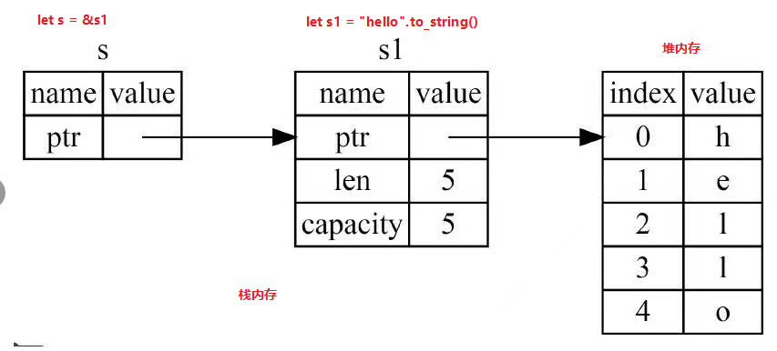
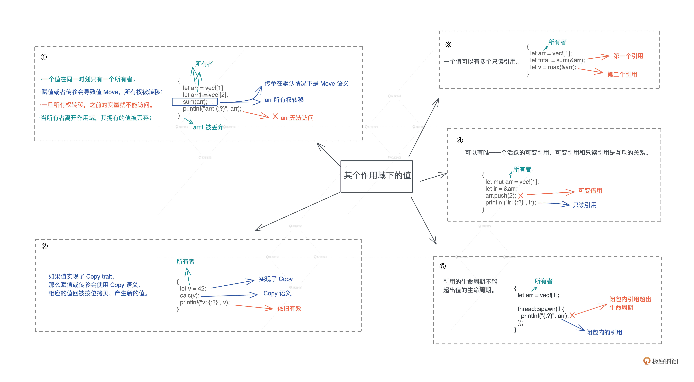

# 所有权

## 堆栈知识

### 内存区域

> 所有在编译器已知固定大小的数据可以存放在栈内存中。反之，这些数据只能存储在堆内存中。

### 堆内存分配

> 当我需要将数据放入堆内存中时，需要向操作系统申请空间。操作系统会寻找一块足够大的空间，标记为已使用，并将地址指针返回给我。这个就是所谓的堆分配过程。操作系统需要及时清理无用数据以避免空间浪费。

## 所有权原则

> - Rust中每一个值都有一个对应的变量作为他的所有者。
> - 在同一时间内，值有且仅有一个所有者(所有者可以更换,但是不能有多个)。
> - 当所有者离自己的作用域时，它持有的值就会被释放掉(值与所有者共存亡)。

### 理解

1. 变量从声明开始生效，到其作用域结束失效。同时其所有的值也会被清理（栈内存数据出栈，堆内存数据会被申请释放）

```rust
    {

        let s : String  = String::from("hello world"); //S开始生效

    }   //离开作用域。S失效，堆内存上的String数据“hello world"也会被销毁
```

2. Rust会在堆内存变量离开其作用域时调用drop函数，将其内存空间释放。而对于栈内存数据，在其离开作用域时并不会发生销毁。

## 所有权转移(move)

> 如果给一个堆内存数据指定两个指针，Rust会直接将数据的所有权转移到后一个指针上，第一个指针随之失效。此时数据的所有权发生了转移(move)。
>
> 变量所有权的转移总是遵循相同的模式：将一个值赋值给另一个变量是就会发生所有权转移。这条规则适用于赋值，同样也适用于函数的参数和返回值。

### 理解

1. 所有权转移可以防止发生，同一块内存区域重复释放两次的BUG

```rust
    fn main(){
        let mut s = String::from("hello");  //数据绑定到s上
        let s1 = s;  //数据所有权转移到s1
        s.push_str(",world"); //错误，s已经失效所以无法操作
        s = String::from("world")//但是此处可以将s重新绑定数据
    } //s1离开作用域，数据释放。由于s之前已经无效，所以不会发生重复释放问题
```

2.数据作为参数传入函数和作为返回值时，也会发生所有权转移

```rust
    fn move_to_fn(s:String)->String{
        println!("{}",s.len());
        s
    } // s所绑定的数据返回，数据所有权转移到调用函数

    fn main(){
        let s = String::from("hello");

        let s1 = move_to_fn(s);  //s绑定数据的所有权转移到函数中

        s.push_str(",world"); //错误，s已经失效无法调用

    }
```
## 引用和借用(borrow)

### 深拷贝和浅拷贝

两种拷贝区别在于拷贝堆内存数据时

- 浅拷贝只拷贝堆内存的栈上指针，例如java的传参、rust的借用传参。这样就造成了多个指针指向同一个数据的局面。
- 深拷贝是直接复制一份指针+堆数据的组合，在rust中需要调用<code>.clone()</code>方法。在堆内存数据很大的情况下，这是一种相当消耗资源的行为

### 使用场景

在函数调用完毕之后，如果我们还想使用传入的参数，需要一种新的所有权分配方式才可以避免值传入函数之后所有权丢失的问题。这种新的方式就是借用，有点像C语言的指针，不转移所有权。

```rust
    fn move_to_fn(s:&String){ //此处的变量s叫做引用，此种所有权分配方式叫做借用
        println!("{}",s.len()); 
    }  //此处没有发生所有权转移，所以函数调用完毕后我们可以继续使用传入的变量
```
### 借用(borrow &)的本质

当借用发生时，实际上产生了一个指向胖指针的引用，造成了引用指向胖指针引，然后胖指针指向数据的局面。



### Rust如何处理多个只读引用

> Rust使用复制策略处理多个只读引用，所以当函数参数为引用时，Rust是直接传值的，传入的是引用的复制体。

下面使用例子说明，注意其中三个引用的地址各不相同。

这个例子同时也解释了{:p}这个格式化字符串的用法。

```rust
fn main() {
    let s = vec![1, 2, 3, 4];
    let s1 = &s;
    /*
    打印数据的内存地址可以使用下面的语法
    注意：
    - 使用格式化字符串{:p}可以输出指针中存储的内存地址
    - 所以如果需要知打印某个数据的地址,先使用&符号构建它的引用,然后打印这个引用的{:p}即可
    - Rust中实现了Pointer Trait的数据结构均可使用{:p}打印
    */
    println!(
        "Addr of s(s1): {:p}({:p}), Addr of &s: {:p}, Addr of s1: {:p}",
        &s, s1, &&s, &s1
    );
    println!("sum of s: {}", sum(s1));
}

fn sum(data: &Vec<i32>) -> i32 {
    println!("addr of data: {:p}, addr of &data: {:p}", data, &data);
    data.iter().fold(0, |acc, x| acc + x)
}
/*
打印&s显示的是s的地址,s1等于s,它们都指向s所以地址相同
Addr of s(s1): 0xe829dff7f8(0xe829dff7f8), 
这行打印的是&s这个引用的地址
Addr of &s: 0xe829dff898, 
这行打印的是s1的地址,可以发现虽然都是s的引用但是它们地址不同。
说明Rust对于多个只读引用使用的策略是直接复制。
Addr of s1: 0xe829dff810
这行打印的是参数data指向的地址,data也指向s所以地址相同
addr of data: 0xe829dff7f8, 
这行打印的是data这个指针的地址,可以发现3个指向s的指针,本身的地址都不相同。
addr of &data: 0xe829dff6c8
sum of s: 10
 */
```

### 防止“使用已释放内存”

由于引用与数据不会被同时销毁，一旦数据离开作用域被释放。如何避免继续使用引用操作已被释放的内存？
Rust对于引用进行了约束，即引用的生命周期不能超过数据本身，编译器会严格进行生命周期检查。

```rust
///这块代码无法编译
fn main(){
    let t = local_ref();
    println!("r: {:p}",r)
}

fn local_ref<'a>() -> &'a i32{
    let a = 43;
    &a
}
```
### 可变引用

> 引用与变量一样默认是不可变的，也就是说对于它指向的值来说是只读的。在mut之前增加&，即可将可变变量转变为可变引用。注意可变变量不一定就是&mut xx这样的形式。

```rust
    fn main(){
        let mut s = String::from("hello");

        change(&mut s);  //可变变量转换为可变引用，再传入函数。

        // 特别注意，只有可变变量才可以直接转换为可变引用，不可变变量无法转换为可变引用

        let a = String::form("hello");

        let a1 = &mut s; // 这样是非法的
    }

    fn change(s:&mut String){ //可变引用类型声明格式“&mut 类型”
        s.push_str("world");
    }
```

- 两个可变引用为什么不能共存？

> 可变引用的引入带来了数据竞争的问题，当两个指针指向同一个数据，其中至少有一个可以修改数据，并且没有同步锁机制的话，就会产生数据竞争

- 可变引用与只读引用为什么不能共存？

> 程序可以通过可变引用修改堆内存数据，如果修改导致操作系统分配的内存区域不够用，操作系统会重新分配一片内存区域。此时只读引用指向的区域为未定义区域，引用失效

- 避免数据竞争和引用失效的方法

> 在同一作用域内，同一时间只可以声明一个可变引用或多个不可变引用。两个可变引用或一个可变一个只读，均不可以同时出现

```rust
    let mut s = String::from("hello");

    let s1 = &s;
    let s2 = &s;    //此时两个只读引用可以同时存在
    let s3 = &mut s; //此时由于三个变量均未使用,所以编译器不会报错
    println!("s: {}", s1, s3) //此时可变引用和不可变引用同时生效,编译器报错
```

> 如果定义了可变引用，但是在只读引用使用之后再使用，可以编译通过。未使用的可变引用可以和只读引用共存

```rust
fn main() {
    let mut v = vec![1,2,3];
    let last = v.last().unwrap();
    println!("last: {:p}",last);
    v.push(4)
}
//但是这样就不可以了
fn main() {
    let mut v = vec![1,2,3];
    let last = v.last().unwrap();
    v.push(4)
    println!("last: {:p}",last);
}
```
### 可变引用延伸——切片

> 很多时候，我们需要获取一个数据片段的指针，此时就可以使用切片。

- 将变量转换为切片的格式为“&变量[起始位置..终点位置+1]”

- 切片适用于字符串类型、数组类型、Vec类型等类型的截取，不可用于tuple类型的截取

- 在显式声明切片类型时，字符串切片写为 “&str”,数组类型写为 “&[数组数据类型]”

### 普通指针与"胖指针"

`普通指针`，即普通引用，指向编译期可以确定大小的类型，例如：&i32、&[u32; 5]。指针只携带内存地址。

`胖指针`，携带内存地址及长度信息的指针，指向动态大小的类型，例如：&str、&[u32]。注意&[u32]由于没有指定数组长度，所以其长度是动态的，与[u32; 5]不同。

```rust
fn main() {
    println!("{}",std::mem::size_of::<&[u32; 5]>());
    println!("{}",std::mem::size_of::<&[u32]>());
    println!("{}",std::mem::size_of::<&str>());
}
/* 8
   16
   16
   胖指针由于需要携带长度信息，其内存大小为16字节
*/
```

## 所有权、move、borrow(不包含reborrow)总结



